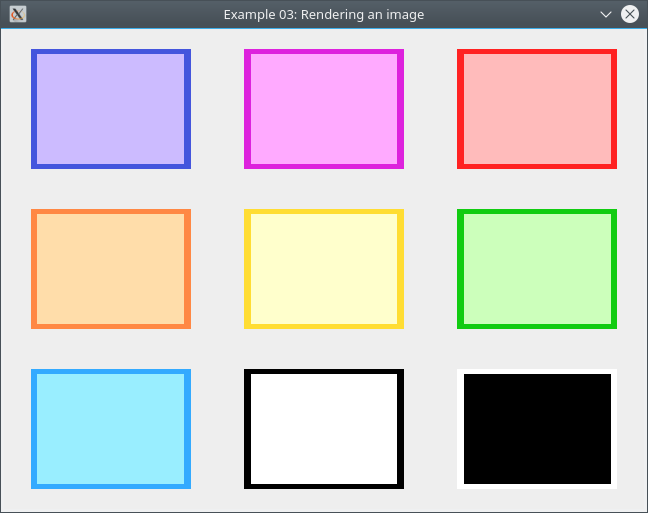

# Example 03 - Rendering an image



In this example, we cover how to load a .png file and render it onto the window. SDL has support for
loading .bmp images out of the box, but for anything other than a .bmp, we need to use an extension
library.

Importing an extension library depends on your development environment. Once again, Lazy Foo' has an
excellent walkthrough for setting this up in his [Lesson 06][3] tutorial.

[Previous][1] | [Next][2]

## The Code

```cpp
#include <SDL2/SDL.h>
#include <SDL2/SDL_image.h>
#include <SDL2/SDL_log.h>

#define SCREEN_HEIGHT 480
#define SCREEN_WIDTH 640

/* Function declarations ******************************************************/

bool init();
void close();
SDL_Texture *loadTexture(const char *const);

/* Static variables ************************************************************
> NOTE:
> In practice, it is best to avoid using global variables.
*******************************************************************************/

/**
 * `gWindow`
 *
 *   The main window.
 */
static SDL_Window *gWindow = NULL;

/**
 * `gRenderer`
 *
 *   The window renderer.
 */
static SDL_Renderer *gRenderer = NULL;

/**
 * `gTexture`
 *
 *   The texture to be rendered.
 */
static SDL_Texture *gTexture = NULL;

/* Main ***********************************************************************/

int main() {

  /*** Initialize. ***/
  if (!init())
    return -1;

  /*** Main loop flag. ***/
  bool quit = false;

  /*** Event handler. ***/
  SDL_Event evt;

  /*** Main loop. ***/
  while (!quit) {

    /*** Handle events on the queue. ***/
    while (SDL_PollEvent(&evt) != 0) {
      switch (evt.type) {
      /*** Handle quit event. ***/
      case SDL_QUIT:
        quit = true;
        break;
      }
    }

    /*** Clear the screen. ***/
    SDL_RenderClear(gRenderer);

    /*** Render texture to screen. ***/
    SDL_RenderCopy(gRenderer, gTexture, NULL, NULL);

    /*** Update the screen. ***/
    SDL_RenderPresent(gRenderer);
  }

  /*** Free resources and close SDL. ***/
  close();

  return 0;
}

/* Function definitions *******************************************************/

/**
 * `init`
 *
 *   Initializes SDL and global data.
 */
bool init() {

  /*** Initialize SDL. ***/
  if (SDL_Init(SDL_INIT_VIDEO) < 0) {
    SDL_LogCritical(SDL_LOG_CATEGORY_ERROR, "Unable to initialize SDL: %s\n",
                    SDL_GetError());
    return false;
  }

  /*** Initialize PNG loading. ***/
  const int imgFlags = IMG_INIT_PNG;
  if (!(IMG_Init(imgFlags) & imgFlags)) {
    SDL_LogError(SDL_LOG_CATEGORY_ERROR, "Unable to initialize SDL_Image: %s\n",
                 IMG_GetError());
    close();
    return false;
  }

  /*** Create the main window. ***/
  gWindow = SDL_CreateWindow("Example 03: Rendering an image",
                             SDL_WINDOWPOS_UNDEFINED, SDL_WINDOWPOS_UNDEFINED,
                             SCREEN_WIDTH, SCREEN_HEIGHT, SDL_WINDOW_SHOWN);
  if (gWindow == NULL) {
    SDL_LogError(SDL_LOG_CATEGORY_ERROR, "Unable to create window: %s\n",
                 SDL_GetError());
    close();
    return false;
  }

  /*** Create renderer for the window. ***/
  gRenderer = SDL_CreateRenderer(gWindow, -1, SDL_RENDERER_ACCELERATED);
  if (gRenderer == NULL) {
    SDL_LogError(SDL_LOG_CATEGORY_ERROR, "Unable to create renderer: %s\n",
                 SDL_GetError());
    close();
    return false;
  }

  /*** Set renderer color. ***/
  SDL_SetRenderDrawColor(gRenderer, 0xEE, 0xEE, 0xEE, 0xEE);

  /*** Load image. ***/
  gTexture = loadTexture("colors.png");
  if (gTexture == NULL) {
    close();
    return false;
  }

  return true;
}

/**
 * `close`
 *
 *   Frees resources and shuts down SDL.
 */
void close() {

  /*** Destroy the texture. ***/
  if (gTexture != NULL) {
    SDL_DestroyTexture(gTexture);
    gTexture = NULL;
  }

  /*** Destroy the renderer. ***/
  if (gRenderer != NULL) {
    SDL_DestroyRenderer(gRenderer);
    gRenderer = NULL;
  }

  /*** Destroy the window. ***/
  if (gWindow != NULL) {
    SDL_DestroyWindow(gWindow);
    gWindow = NULL;
  }

  /*** Quit SDL subsystems. ***/
  IMG_Quit();
  SDL_Quit();
}

/**
 * `loadTexture`
 *
 *   Loads a texture from file.
 */
SDL_Texture *loadTexture(const char *const path) {

  /*** Load the image as a surface. ***/
  SDL_Surface *surface = IMG_Load(path);
  if (surface == NULL) {
    SDL_LogError(SDL_LOG_CATEGORY_ERROR, "Unable to load image '%s': %s\n",
                 path, IMG_GetError());
    return NULL;
  }

  /*** Create texture from surface pixels. ***/
  SDL_Texture *texture = SDL_CreateTextureFromSurface(gRenderer, surface);
  SDL_FreeSurface(surface);
  if (texture == NULL) {
    SDL_LogError(SDL_LOG_CATEGORY_ERROR,
                 "Unable to create texture from '%s': %s\n", path,
                 SDL_GetError());
    return NULL;
  }

  return texture;
}
```

Right away, you should notice that the code is just a modified version from [Example 02][1]. Not a
whole lot has changed; the `main()` function has been reduced to only handling the quit event and
drawing the image; the `init()` function has been extended to include logic for loading the image;
the `close()` function has been extended to accomodate the changes in the `init()` function; and, a
new function is introduced for handling loading images as a texture.

For the sake of brevity, we will only cover what is different from [Example 02][1].

### The `init()` function

```cpp
  /*** Initialize PNG loading. ***/
  const int imgFlags = IMG_INIT_PNG;
  if (!(IMG_Init(imgFlags) & imgFlags)) {
    SDL_LogError(SDL_LOG_CATEGORY_ERROR, "Unable to initialize SDL_Image: %s\n",
                 IMG_GetError());
    close();
    return false;
  }
```

Since we are loading an image that is not a .bmp file, we must use the SDL_image extension library.
Once the library has been imported, we need to initialize it just like we do with SDL. We do this by
calling [`IMG_Init()`][4].

> There is some discussion on whether or not calling `IMG_Init()` is necessary. It might be a good
> idea to call `IMG_Init()` early to avoid bottlenecks in your code. In general, you want to avoid
> loading resources in the main loop. Go [here][5] for more relevant discussion.

```cpp
  /*** Create renderer for the window. ***/
  gRenderer = SDL_CreateRenderer(gWindow, -1, SDL_RENDERER_ACCELERATED);
  if (gRenderer == NULL) {
    SDL_LogError(SDL_LOG_CATEGORY_ERROR, "Unable to create renderer: %s\n",
                 SDL_GetError());
    close();
    return false;
  }

  /*** Set renderer color. ***/
  SDL_SetRenderDrawColor(gRenderer, 0xEE, 0xEE, 0xEE, 0xEE);
```

Rendering images as textures is more efficient than [blitting][6]. To render textures, we need to
create a renderer by calling [`SDL_CreateRenderer()`][7]. Once created, we can set its draw color
with [`SDL_SetRenderDrawColor()`][8]. This is useful if we want to render geometry or fill the
window with a solid color.

```cpp
  /*** Load image. ***/
  gTexture = loadTexture("colors.png");
  if (gTexture == NULL) {
    close();
    return false;
  }
```

Once the renderer has been created, we load the texture using our `loadTexture()` function.

### The `close()` function

```cpp
  /*** Destroy the texture. ***/
  if (gTexture != NULL) {
    SDL_DestroyTexture(gTexture);
    gTexture = NULL;
  }

  /*** Destroy the renderer. ***/
  if (gRenderer != NULL) {
    SDL_DestroyRenderer(gRenderer);
    gRenderer = NULL;
  }

  ...

  /*** Quit SDL subsystems. ***/
  IMG_Quit();
  SDL_Quit();
```

Cleanup proceeds as usual: we destroy the loaded texture if it hasn't been done already, and do the
same for the renderer. Since we initialized SDL_image earlier, we must also uninitialize it with
[`IMG_Quit()`][9].

### The `loadTexture()` function

```cpp
SDL_Texture *loadTexture(const char *const path) {

  /*** Load the image as a surface. ***/
  SDL_Surface *surface = IMG_Load(path);
  if (surface == NULL) {
    SDL_LogError(SDL_LOG_CATEGORY_ERROR, "Unable to load image '%s': %s\n",
                 path, IMG_GetError());
    return NULL;
  }

  /*** Create texture from surface pixels. ***/
  SDL_Texture *texture = SDL_CreateTextureFromSurface(gRenderer, surface);
  SDL_FreeSurface(surface);
  if (texture == NULL) {
    SDL_LogError(SDL_LOG_CATEGORY_ERROR,
                 "Unable to create texture from '%s': %s\n", path,
                 SDL_GetError());
    return NULL;
  }

  return texture;
}
```

The `loadTexture()` function first attempts to load the image from the provided path with
[`IMG_Load()`][10], then attempts to create the texture with [`SDL_CreateTextureFromSurface()`][11].

### The `main()` function

```cpp
    /*** Handle events on the queue. ***/
    while (SDL_PollEvent(&evt) != 0) {
      switch (evt.type) {
      /*** Handle quit event. ***/
      case SDL_QUIT:
        quit = true;
        break;
      }
    }
```

Handling input events is out of the scope of this example, so keyboard events have been removed from
the event handlers.

```cpp
    /*** Clear the screen. ***/
    SDL_RenderClear(gRenderer);

    /*** Render texture to screen. ***/
    SDL_RenderCopy(gRenderer, gTexture, NULL, NULL);

    /*** Update the screen. ***/
    SDL_RenderPresent(gRenderer);
```

Updating the window is similar to what we've seen before but with different functions. First, we
clear the window with a solid color using [`SDL_RenderClear()`][12]; then, we copy the whole texture
to the window with [`SDL_RenderCopy()`][13]; finally, we present the changes to the user by
refreshing the screen with [`SDL_RenderPresent()`][14].

---

[Previous][1] | [Next][2]

## Resources

* [Lazy Foo's Lesson 02][15]
* [Lazy Foo's Lesson 05][16]
* [Lazy Foo's Lesson 06][3]
* [Lazy Foo's Lesson 07][17]
* [SDL_image][18]
* [IMG_Init()][4]
* [IMG_Quit()][9]
* [IMG_Load()][10]
* [SDL_Renderer][19]
* [SDL_Texture][20]
* [SDL_CreateRenderer()][7]
* [SDL_DestroyRenderer()][21]
* [SDL_SetRenderDrawColor()][8]
* [SDL_RenderClear()][12]
* [SDL_RenderCopy()][13]
* [SDL_RenderPresent()][14]
* [SDL_CreateTextureFromSurface()][11]
* [SDL_DestroyTexture()][22]

[1]: ../02_handling-events
[2]: ../04_rendering-text
[3]: http://lazyfoo.net/tutorials/SDL/06_extension_libraries_and_loading_other_image_formats/index.php
[4]: https://www.libsdl.org/projects/SDL_image/docs/SDL_image.html#SEC8
[5]: https://forums.libsdl.org/viewtopic.php?p=49682&sid=e938700dfe09bd21a1ccd6f06fe8dc55
[6]: https://wiki.libsdl.org/SDL_BlitSurface
[7]: https://wiki.libsdl.org/SDL_CreateRenderer
[8]: https://wiki.libsdl.org/SDL_SetRenderDrawColor
[9]: https://www.libsdl.org/projects/SDL_image/docs/SDL_image.html#SEC9
[10]: https://www.libsdl.org/projects/SDL_image/docs/SDL_image.html#SEC11
[11]: https://wiki.libsdl.org/SDL_CreateTextureFromSurface
[12]: https://wiki.libsdl.org/SDL_RenderClear
[13]: https://wiki.libsdl.org/SDL_RenderCopy
[14]: https://wiki.libsdl.org/SDL_RenderPresent
[15]: http://lazyfoo.net/tutorials/SDL/02_getting_an_image_on_the_screen/index.php
[16]: http://lazyfoo.net/tutorials/SDL/05_optimized_surface_loading_and_soft_stretching/index.php
[17]: http://lazyfoo.net/tutorials/SDL/07_texture_loading_and_rendering/index.php
[18]: https://www.libsdl.org/projects/SDL_image/docs/SDL_image.html
[19]: https://wiki.libsdl.org/SDL_Renderer
[20]: https://wiki.libsdl.org/SDL_Texture
[21]: https://wiki.libsdl.org/SDL_DestroyRenderer
[22]: https://wiki.libsdl.org/SDL_DestroyTexture
